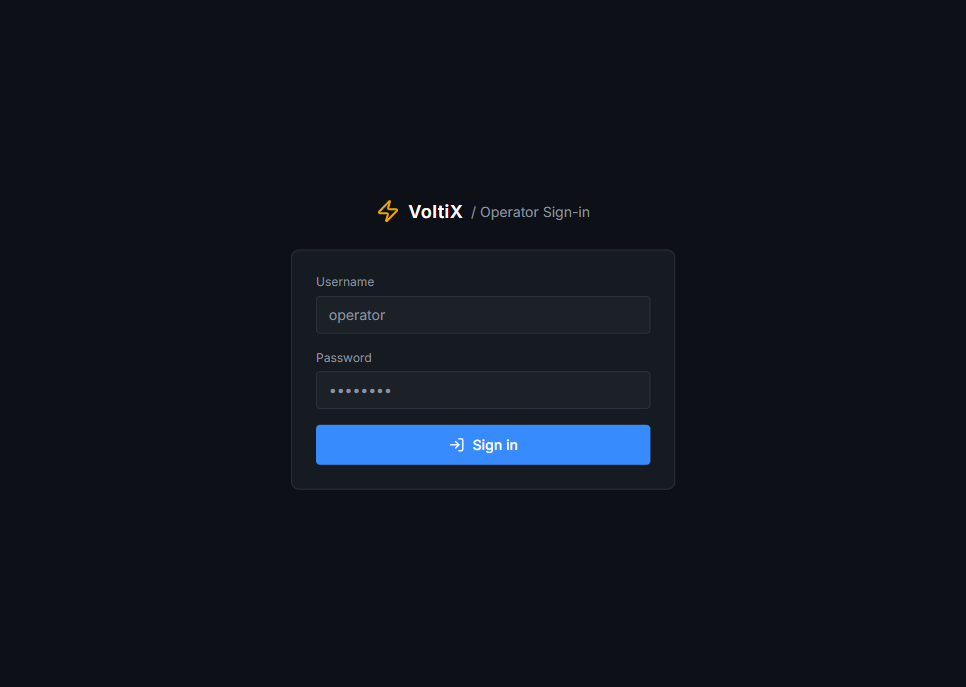
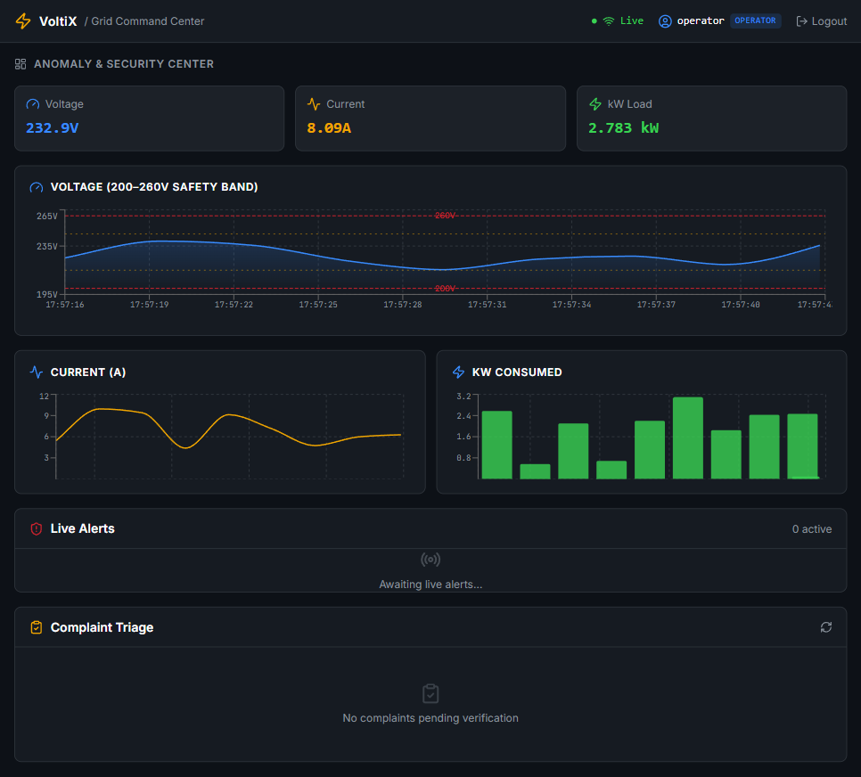
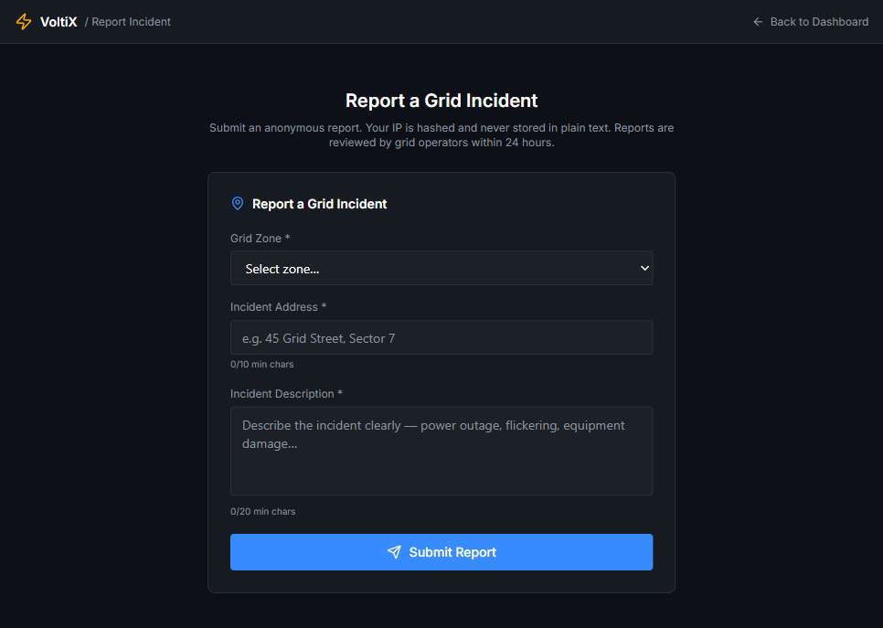

# VoltiX Dashboard — Frontend Audit Report

> Scope: `voltix-dashboard/` (React 19 + TypeScript + Vite frontend for the VoltiX-2 smart-grid backend on `localhost:8080`).
> Purpose: catalogue what the frontend currently is, what it does well, and every real flaw — as the basis for the staged rebuild.
> Status: living document — updated to reflect **Phase 1 (Authentication & Route Protection) completion**. Findings tagged **✅ RESOLVED** have been fixed and verified end-to-end against the running backend; all others remain open.

---

## 1. Stack & Tooling

| Layer | Choice | Version |
|---|---|---|
| Framework | React | 19.2 |
| Language | TypeScript | 6.0 |
| Build | Vite | 8.1 |
| Styling | Tailwind CSS | v4 (CSS-based `@theme`) |
| State | Zustand | 5.0 |
| Charts | Recharts | 3.9 |
| Realtime | `@stomp/stompjs` (native WS) | 7.3 |
| HTTP | axios | 1.18 |
| Routing | react-router-dom | 7.18 |
| Icons | lucide-react | 1.24 |

Modern, sensible stack. No complaints about the dependency choices themselves.

---

## 2. What It Currently Has (Features)

**Two routes** (`App.tsx`):
- `/` → **Dashboard** (operator "Grid Command Center")
- `/report` → **PublicSubmit** (anonymous incident form)

**Dashboard** (`pages/Dashboard.tsx`) — single-screen 12-column layout, no scroll:
- **Header bar**: logo, unread-alert badge, live WS connection status.
- **GridMetricsEngine** (8/12): KPI strip (Voltage / Current / kW) + voltage area chart with 200–260 V safety band + current line chart + kW bar chart.
- **AlertsFeed** (8/12): live severity-sorted alert list, per-row ACK, clear-all, empty state.
- **ComplaintTriagePanel** (4/12): fetches pending complaints, Escalate / Reject actions, retry/refresh.

**PublicSubmit** (`pages/PublicSubmit.tsx`): validated complaint form (zone, address, description) with debounced validation, rate-limit handling, success/error banners.

**Cross-cutting infrastructure (genuinely good):**
- STOMP-over-WebSocket hook with **exponential-backoff reconnect** (`hooks/useWebSocket.ts`).
- Zustand store with rolling 200-alert window + dedup (`store/alertStore.ts`).
- Per-panel **ErrorBoundary** so one crash doesn't take down the page.
- Lazy-loaded routes, `React.memo` on hot components, typed DTOs mirroring the backend.
- Consistent dark "operational" design token palette.

---

## 2a. Screenshots — Current UI

> Captured live against the running app (`localhost:5173`) with the backend on `localhost:8080`.
> The `operator / OPERATOR / Logout` header controls are the **Phase-1 auth implementation that resolved F2** (see §3); everything below the header is the originally-audited UI.

### Operator Sign-in (`/login`)

### Dashboard — "Grid Command Center" (`/`)

The voltage/current/kW charts below are the **fabricated** `Math.random()` data described in flaw **F1** — they are not bound to any backend telemetry.

### Public Incident Report form (`/report`)

Note the hardcoded `Zone 1–5` dropdown (flaw **F8**).

---

## 3. Flaws — Ranked by Severity

> **Remediation status:** 1 of 13 resolved — **F2** (auth) fixed and verified in Phase 1 (branch `frontend/phase-1-auth`). The remaining 12 are open and slated for Phases 2–4.

### 🔴 Critical

**F1. The grid metrics are 100% fabricated.**
`components/GridMetricsEngine.tsx` never calls the backend. Every voltage/current/kW value is `Math.random()`, and `generatePointFromAlerts` fudges voltage off an anomaly score. The code even admits it: *"In production: also poll GET /api/v1/telemetry/latest"*. For a "Grid Command Center," the central chart panel is pure theater. There is also **no telemetry GET endpoint** on the backend (only `POST /api/v1/telemetry/submit`), so this panel has nothing real to bind to yet.

**F2. Auth was a hardcoded, invalid token. — ✅ RESOLVED (Phase 1, branch `frontend/phase-1-auth`)**
*Original finding:* `api/client.ts` shipped a `DEV_TOKEN` whose signature segment was `c2lnbmF0dXJl` — literally base64 for the word `"signature"`, not a real HMAC. Every authenticated call (complaint list + triage) returned 401, so the triage panel was permanently stuck in its "Failed to load complaints" error state. There was **no login page**, and the real `POST /api/v1/auth/login` endpoint went unused.
*Fix delivered & verified:* `DEV_TOKEN` and the `localStorage` token helpers were deleted; a real `/login` page now POSTs to `/api/v1/auth/login` and holds the returned JWT **in memory only** (never localStorage/sessionStorage, for XSS safety). Added `AuthContext`, a `ProtectedRoute` guard (`/` and `/report` redirect to `/login` when unauthenticated), a logout action, and an identity display (username + role) read from the JWT claims. End-to-end evidence: `operator/password` → real JWT (`sub=operator`, `roles=[OPERATOR]`); triage panel loads real data (`GET /complaints?status=PENDING_VERIFICATION` → `200 []`); wrong creds → `401 {"error":"Invalid credentials"}` surfaced in the UI; logout clears the session and re-redirects to `/login`. Trade-off: a full page reload drops the in-memory token and forces re-login.

### 🟠 High

**F3. `unreadCount` only ever grows.**
`store/alertStore.ts`: `addAlert` increments, but `markAcknowledged` doesn't decrement it. Only "Clear all" resets it. The header badge is effectively a lifetime counter, not an unread count.

**F4. Tailwind v4 / v3 config split — silent dead styling.**
Colors and animations are defined **twice**: in `index.css` `@theme` (the v4 way) and in `tailwind.config.js` (the v3 way). Under Tailwind v4 the JS config is largely ignored, and `animate-pulse-critical` (used by CRITICAL alert rows) is defined **only** in the JS config — so the critical-alert pulse likely doesn't render. Two conflicting sources of truth.

**F5. Realtime bypasses the Vite proxy.**
`hooks/useWebSocket.ts` hardcodes `ws://localhost:8080/...` instead of using the `/ws` proxy configured in `vite.config.ts`. It won't work behind the dev proxy or in any deployed environment.

### 🟡 Medium

- **F6. Dead code:** `src/App.css` is 184 lines of the default Vite starter template (`.hero`, `.vite`, `#next-steps`) — **imported nowhere**.
- **F7. No in-app navigation:** `NavLink` is imported in `App.tsx` but never rendered. Users can't discover `/report`; the two pages are islands.
- **F8. Hardcoded domain data:** zones are `[1,2,3,4,5]` in the form (`components/ComplaintSubmissionForm.tsx`); not fetched.
- **F9. Type inconsistency:** `ComplaintSubmitResponse.complaintId` is `string` but `PublicComplaint.complaintId` is `number` (`types/index.ts`).
- **F10. `useDebounce`** (`components/ComplaintSubmissionForm.tsx`) uses `useRef()` with no initial value and adds a 500 ms lag before *any* validation feedback.

### 🟢 Low / Polish

- **F11. Accessibility:** icon-only buttons (ACK, refresh) lack `aria-label`; severity is encoded by color alone.
- **F12. StrictMode churn:** the WS client activates/deactivates twice in dev (harmless but noisy).
- **F13. Thin feature surface:** only alerts + complaints + fake charts. Nothing for historical telemetry, zone/meter drill-down, the ML anomaly/macro-monitor model outputs, or an operator overview — despite the backend supporting a much richer domain.

---

## 4. Design / UX Assessment

The current UI is a **single fixed-height "TV wall" layout** — everything crammed into one non-scrolling 12-column grid. It looks dense but:
- It doesn't scale past the three hardcoded panels.
- No navigation, no drill-down, no historical views, no meter/zone context.
- Below `lg` it just stacks vertically with no real responsive design.
- Half of what it shows (the headline charts) is fake data.

The dissatisfaction is well-founded: it's a good-looking **skeleton demo**, not an operational tool.

---

## 5. Summary for the Refactor

**Keep / reuse:** the design token palette, `useWebSocket` (fix the URL), `alertStore` (fix `unreadCount`), `ErrorBoundary`, typed DTOs, the complaint form.

**Done (Phase 1):** real login flow against `/api/v1/auth/login` with in-memory JWT, route protection, logout, and identity display — **F2 closed**.

**Must fix or rebuild:** real telemetry data source (needs a backend GET endpoint), single Tailwind v4 token source, navigation shell, and a genuine multi-view IA (overview → zones → meters → alerts → complaints → model insights).

**Delete:** `src/App.css`.

---

## 6. Flaw Index (quick reference)

| ID | Severity | Flaw | Primary file | Status |
|----|----------|------|--------------|--------|
| F1 | 🔴 Critical | Grid metrics 100% fabricated (`Math.random()`) | `components/GridMetricsEngine.tsx` | Open |
| F2 | 🔴 Critical | Hardcoded, invalid fake JWT; no login page | `api/client.ts` | ✅ Fixed (Phase 1) |
| F3 | 🟠 High | `unreadCount` never decrements | `store/alertStore.ts` | Open |
| F4 | 🟠 High | Tailwind v4/v3 config split; dead `animate-pulse-critical` | `index.css` / `tailwind.config.js` | Open |
| F5 | 🟠 High | WebSocket bypasses Vite proxy (hardcoded URL) | `hooks/useWebSocket.ts` | Open |
| F6 | 🟡 Medium | Dead Vite-starter CSS, imported nowhere | `src/App.css` | Open |
| F7 | 🟡 Medium | No in-app navigation; `/report` undiscoverable | `App.tsx` | Open |
| F8 | 🟡 Medium | Hardcoded zone list `[1..5]` | `components/ComplaintSubmissionForm.tsx` | Open |
| F9 | 🟡 Medium | `complaintId` type mismatch (string vs number) | `types/index.ts` | Open |
| F10 | 🟡 Medium | `useDebounce` no-arg `useRef`; 500 ms validation lag | `components/ComplaintSubmissionForm.tsx` | Open |
| F11 | 🟢 Low | Icon-only buttons lack `aria-label`; color-only severity | multiple | Open |
| F12 | 🟢 Low | StrictMode WS double-invoke in dev | `hooks/useWebSocket.ts` | Open |
| F13 | 🟢 Low | Thin feature surface vs backend capability | overall | Open |
